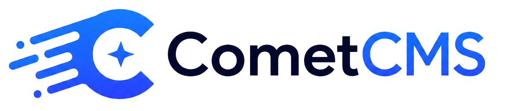

<p align="center">
  
</p>

<p align="center">
  A lightweight headless CMS that runs on any shared PHP host.<br />
  No Node, no Composer, no database, no CLI, no SSH required.
</p>

---

## Why CometCMS

The entire CMS is a single PHP folder you upload to your server. That's it.

- **PHP 8.2+ is the only production dependency.** Every cheap shared hoster has it.
- **No database.** Content is stored as JSON files in `storage/`.
- **No Composer.** Nothing to install on the server.
- **No build step to deploy.** Run `make build` locally once, upload the `dist/` folder, done.
- **Headless & API-first.** Use any consumer — Next.js, Astro, SvelteKit, a mobile app, plain `fetch`, anything.
- **Fine-grained API token permissions.** Scope tokens by action, content type, media category, and field. No overly broad keys.
- **Integrated backup system.** Create and restore full backups of all content, media, and settings from the admin UI.
- **Built-in localization.** Content types support multiple locales; the API resolves translations with a single `?locale=` parameter.
- **Intentionally simple.** Not a framework, not extensible to infinity. Just a clean JSON API with an admin UI.

## Quick Start

1. Download the latest release from the Github releases.
2. Upload the contents of the .zip to your hosting account via FTP or your host's file manager.
3. Navigate to `https://yourdomain.com/admin` in your browser.
4. Create your admin account on the setup screen.
5. Define content types, add entries, fetch the API.

No SSH. No CLI. No `composer install`. No environment variables required. Runs on the cheapest php hosting you can find.

## Public REST API

The API lives at `/api/v1`. No authentication is required for public reads. A machine-readable OpenAPI contract is available at `docs/public/api/openapi.yaml` and is served in the docs as `/api/openapi.yaml`.

### Health

```
GET /api/v1/health
```

### Content

```
GET    /api/v1/content-types                            # list content type schemas
GET    /api/v1/content-types/{collection}               # single content type schema
GET    /api/v1/content/{collection}                     # list entries (published only)
GET    /api/v1/content/{collection}/{identifier}        # single entry by slug or stable id
POST   /api/v1/content/{collection}                     # create entry (token required)
PUT    /api/v1/content/{collection}/{identifier}        # update entry (token required)
DELETE /api/v1/content/{collection}/{identifier}        # soft-delete entry (token required)
```

Entry payloads use `id` for a stable opaque identifier and `slug` for the URL-safe slug. `{identifier}` may be either value.

Content types can be repeatable collections or single pages. Single pages use one fixed entry whose slug matches the content type name, e.g. `GET /api/v1/content/start-page/start-page`.

Public reads return only `published` entries, or `scheduled` entries whose `published_at` is in the past. `draft`, `protected`, `archived`, and soft-deleted entries are hidden unless an authenticated token is used.

### Media

```
GET /api/v1/media          # list uploaded files (with optional ?category=... and pagination)
GET /media/{filename}      # serve a media file directly
```

### Authentication

Pass an API token in the `Authorization` header:

```
Authorization: Bearer ctcms_...
```

Public reads work without a token and only return public content. Tokens use the same permission grant format as roles, so access can be limited by action, content type, entry, media category, and field. Tokens are created in the **API-Tokens** section of the admin. Trash, backup/restore, settings, users, tokens, and webhook management are admin-only features under `/admin/api`.

### Filtering, Sorting, and Pagination

All list endpoints support:

| Parameter                 | Example                                 | Description                                |
| ------------------------- | --------------------------------------- | ------------------------------------------ |
| `limit`                   | `?limit=20`                             | Number of results (omit for all)           |
| `offset`                  | `?offset=40`                            | Pagination offset                          |
| `sort`                    | `?sort=-published_at`                   | Sort field; prefix with `-` for descending |
| `q`                       | `?q=hello`                              | Full-text search across text fields        |
| `locale`                  | `?locale=de`                            | Resolve localized fields for that locale   |
| `filter[field]`           | `?filter[is_promo_material]=true`       | Exact match                                |
| `filter[field][in]`       | `?filter[category][in]=news,tech`       | One of several values                      |
| `filter[field][ne]`       | `?filter[category][ne]=draft`           | Not equal                                  |
| `filter[field][gt]`       | `?filter[price][gt]=10`                 | Greater than                               |
| `filter[field][gte]`      | `?filter[published_at][gte]=2025-01-01` | Greater than or equal                      |
| `filter[field][lt]`       | `?filter[price][lt]=100`                | Less than                                  |
| `filter[field][lte]`      | `?filter[published_at][lte]=2025-12-31` | Less than or equal                         |
| `filter[field][contains]` | `?filter[title][contains]=launch`       | Case-insensitive substring match           |

Use `filter[...]` for all field queries. Boolean fields accept `true`/`false` (also `1`/`0`). Select fields can be matched by their stored option value; when a field stores an array, filters match if any item in the array matches. Public API media fields are always arrays of absolute media URLs, including single-file media fields. Sorting is type-aware for numeric values and ISO-style dates.

Localized content types expose `locales` and `default_locale` in their schema. Add `?locale={code}` to list or single-entry reads to resolve translated `title` and field values before search, filters, sorting, and relation expansion are applied. Without `locale`, responses use the content type's default-locale fallback copy.

```http
GET /api/v1/content/blogpost?filter[is_promo_material]=true
GET /api/v1/content/blogpost?filter[category]=launch
GET /api/v1/content/blogpost?filter[id]=7K4p9xQ2mR
```

### Response envelope

Successful JSON responses are wrapped in `data`; list responses and secondary information use `meta`. Errors use an `error` object with a stable `code` and human-readable `message`.

```json
{
  "data": [],
  "meta": {
    "limit": 20,
    "offset": 0,
    "total": 42
  }
}
```

### Relation expansion

Relation fields can be expanded with `?include=field1,field2` (one level deep):

```
GET /api/v1/content/posts/my-post?include=author,categories
```

## Webhooks

Configure outbound webhook URLs in the admin under **Webhooks**. CometCMS sends a signed `POST` request whenever content changes - useful for triggering SSG builds.

Each webhook fires on the events you select: `content.published`, `content.updated`, `content.deleted`, and more. Payloads are signed with HMAC-SHA256 via the `X-CometCMS-Signature` header.

See the [webhook documentation](docs/guide/webhooks.md) for the full payload format and signature verification examples.

## Updates

The admin sidebar version and **Updates** navigation item open `/admin/update`. Update checks read GitHub release metadata from `updates.repository_url` in `config/config.php`, which defaults to `https://github.com/CometCMS/CometCMS`. Installable releases should include a built ZIP asset matching `updates.release_asset_pattern` and a `.sha256` checksum asset matching `updates.checksum_asset_pattern`.

CometCMS supports public GitHub releases for update checks and downloads. The update flow downloads and verifies a release ZIP first, then installs the staged package in a separate step.

Installation replaces release-owned application files and folders while preserving the configured `updates.preserved_paths`; by default that keeps `storage/` for content, media, users, revisions, trash and sessions, plus `config/config.php` for local self-hosting settings. Whole release-owned folders such as `app/` and `admin/` are replaced, so old files removed from a release do not linger.

## Admin UI

| URL                           | Description            |
| ----------------------------- | ---------------------- |
| `/admin`                      | Dashboard              |
| `/admin/content/{collection}` | Content entries        |
| `/admin/media`                | Media library          |
| `/admin/users`                | Users                  |
| `/admin/api-tokens`           | API tokens             |
| `/admin/backups`              | Backup and restore     |
| `/admin/webhooks`             | Outbound webhooks      |
| `/admin/update`               | GitHub release updates |

### Roles

| Role     | Permissions                                  |
| -------- | -------------------------------------------- |
| `admin`  | Built-in full-access role; cannot be deleted |
| `editor` | Built-in content and media editing role      |
| `viewer` | Built-in read-oriented role                  |

Roles can be customized or created in **Users → Edit user roles**.

## Storage layout

All data lives in `cms/storage/` (not web-accessible):

```
storage/
  content/{collection}/{slug}.json   - content entries
  content-types/{name}.json          - content type schemas
  users/{username}.json              - user accounts
  roles/{name}.json                  - customized role definitions
  media/                             - uploaded files
  revisions/content/                 - revision history
  trash/                             - soft-deleted entries
  backups/                           - saved backup ZIP files
  cache/api/                         - public API response cache
  updates/                           - downloaded update packages
  settings.json                      - runtime settings (webhooks etc.)
  logs/comet.log
```

## Local Development

PHP 8.2+ and Node 18+ must be installed locally. No Composer or database needed.
I'm primary a javascript developer so the setup is done with npm scripts and Makefile commands, but the PHP code is vanilla and does not require a local server to run tests or build.

```bash
npm install   # install workspace dependencies
make dev      # start PHP + Vite together
```

Open `http://localhost:8000/admin`. The first visit shows the setup screen.

## Build for production

```bash
make build
```

This assembles a deployment-ready `dist/` folder containing the PHP CMS, compiled admin UI in `dist/admin/`, config, rewrite files, and clean storage placeholders. Upload the contents of `dist/` to your server; production does not need Node.

## Testing

Run the full local test suite before shipping:

```bash
make test
```

That command lints PHP and Vue files, runs the Composer-free backend tests in `tests/php`, and runs the Vue/Vite unit tests with Vitest. For the same verification CI performs before a release build, run:

```bash
make ci
```

You can also run the layers independently:

```bash
make test-backend
make test-frontend
npm --workspace web run test:watch
```

## Local reset

To wipe all data and return to the setup screen, just delete the storage folder. If you want to keep users and roles but reset content, media, sessions, logs, and settings, run:

```bash
rm -f cms/storage/users/*.json
rm -f cms/storage/roles/*.json
rm -rf cms/storage/content/*
rm -rf cms/storage/content-types/*
rm -f cms/storage/media/*
rm -f cms/storage/sessions/*
rm -rf cms/storage/cache/api/*
rm -rf cms/storage/trash/content/*
rm -rf cms/storage/trash/media/*
rm -f cms/storage/logs/*.log
rm -f cms/storage/backups/*.zip
rm -rf cms/storage/updates/*
rm -f cms/storage/settings.json
```

## License

Apache License 2.0 - see [LICENSE](LICENSE).
